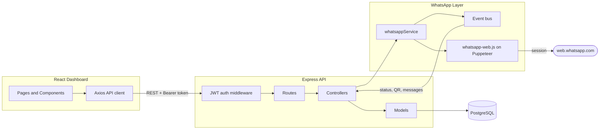
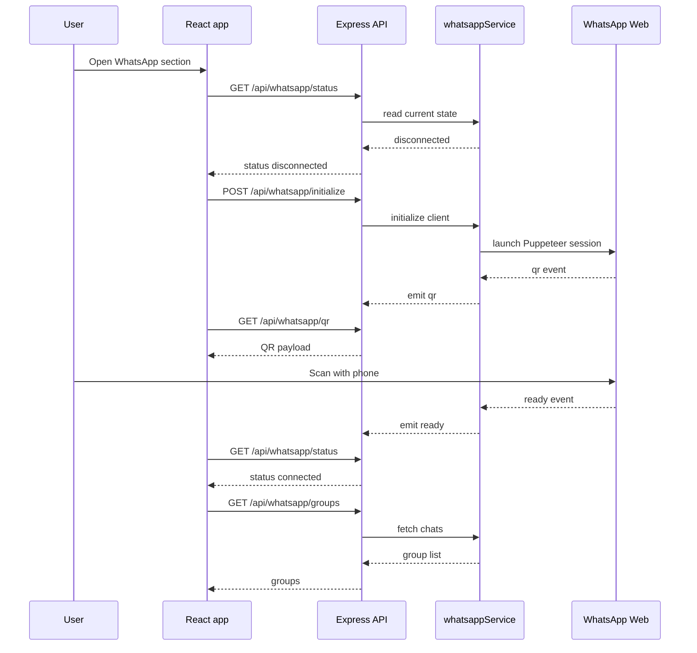
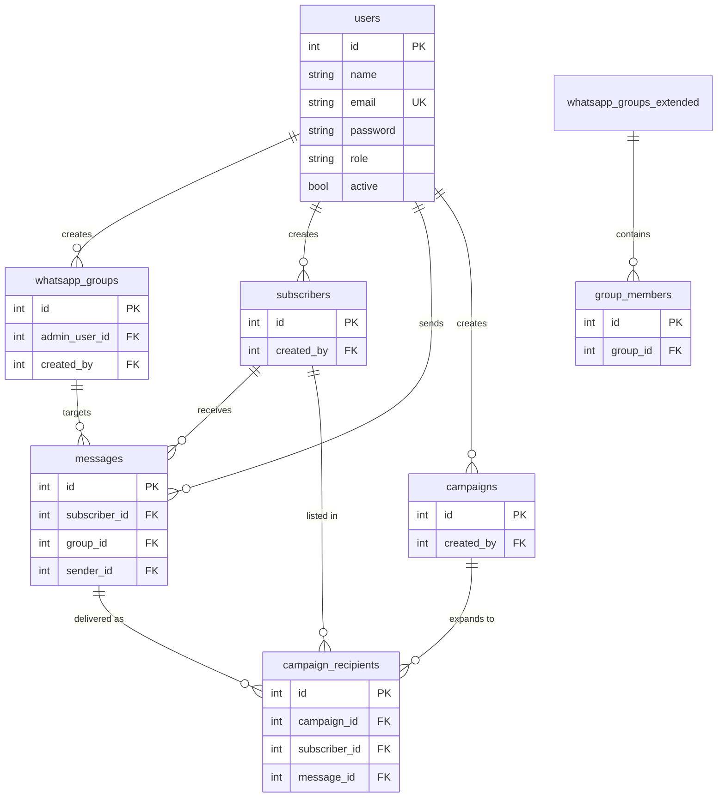

<div align="center">


# Watify

**WhatsApp Business Automation Platform**

Group management, bulk messaging, and campaign tracking on top of WhatsApp Web.


</div>

---

> **Access note.** This is a B2B product deployed behind Wateen's IP allowlist, so
> the hosted instance is not reachable from the public internet. Run it locally
> with the instructions below to try it.

## Overview

Watify drives a real WhatsApp account programmatically through `whatsapp-web.js`.
An Express API owns the session, exposes group and messaging operations, and
persists everything to PostgreSQL. A React dashboard handles authentication, QR
pairing, group browsing, and bulk sends.

## Architecture



## Features

- **WhatsApp Web integration** with persistent session and QR pairing
- **Group management** for browsing, creating, editing, and inspecting groups
- **Bulk messaging** with a configurable delay between sends and retry backoff
- **Member management** including Excel import and export
- **Campaigns** with per-recipient delivery tracking
- **JWT authentication** with bcrypt password hashing
- **Connection health** reporting via an event bus rather than polling

## Connection flow

Pairing is the part most worth understanding, because the session is long-lived
and the QR is only valid briefly.



## Data model

Core tables and the relationships actually declared in the migrations:



Migrations live in `backend/migrations/`, each with a matching rollback in
`backend/migrations/rollbacks/`.

## Tech stack

| Layer | Technology |
|---|---|
| Runtime | Node.js 18+ |
| API | Express 4, Helmet, CORS |
| Database | PostgreSQL 12+ via `pg` |
| WhatsApp | `whatsapp-web.js` on Puppeteer |
| Auth | JSON Web Tokens, bcryptjs |
| Frontend | React 19, Material UI 7, React Router 7 |
| Data fetching | Axios, TanStack Query |
| Spreadsheets | SheetJS (`xlsx`) |

## Project structure

```
Watify/
├── backend/
│   ├── config/          Database, app, and WhatsApp client configuration
│   ├── controllers/     Request handlers
│   ├── middleware/      JWT verification
│   ├── migrations/      Schema migrations and rollbacks
│   ├── models/          Data access layer
│   ├── routes/          API route definitions
│   ├── services/        whatsappService and the event bus
│   ├── scripts/         Migration runner, seeding, diagnostics
│   └── server.js        Application entry point
├── frontend/
│   ├── public/          Static assets
│   └── src/
│       ├── components/  Auth, messaging, and WhatsApp UI
│       ├── contexts/    Auth and theme providers
│       ├── pages/       Home and Dashboard
│       ├── services/    API clients
│       └── utils/       Config and validation
├── landing-page/        Standalone marketing page
└── scripts/             Local PostgreSQL helpers
```

## Getting started

### Prerequisites

- Node.js 18 or higher
- PostgreSQL 12 or higher
- Chrome or Chromium, required by Puppeteer for WhatsApp Web

### Install

```bash
git clone https://github.com/cruspy2004/Watify.git
cd Watify
npm install
cd backend && npm install
cd ../frontend && npm install --legacy-peer-deps
```

### Configure

Create a `.env` file in the project root:

```env
DB_HOST=localhost
DB_PORT=5432
DB_NAME=wateen_watify
DB_USER=your_username
DB_PASSWORD=your_password

JWT_SECRET=replace_with_a_long_random_secret
JWT_EXPIRE=7d

PORT=5001
NODE_ENV=development
CLIENT_URL=http://localhost:3000
```

The frontend proxies to port 5001, so keep `PORT` aligned with it. `backend/server.js`
falls back to 5000 when `PORT` is unset.

### Create the database

```bash
createdb wateen_watify
npm run migrate
```

### Run

```bash
npm run dev:backend
npm run dev:frontend
```

The dashboard is served at `http://localhost:3000`.

## Pairing WhatsApp

1. Start the backend first, so the session manager is live.
2. Sign in to the dashboard and open the WhatsApp section.
3. Scan the QR code with the WhatsApp mobile app.
4. Groups are fetched automatically once the client reports ready.

The session is cached in `.wwebjs_auth/`, so subsequent starts reconnect without a
new scan. Delete that directory to force re-pairing.

## API

### Authentication

| Method | Endpoint | Purpose |
|---|---|---|
| POST | `/api/auth/register` | Create an account |
| POST | `/api/auth/login` | Obtain a JWT |
| GET | `/api/auth/profile` | Current user, requires bearer token |

### WhatsApp

| Method | Endpoint | Purpose |
|---|---|---|
| GET | `/api/whatsapp/status` | Connection state |
| GET | `/api/whatsapp/qr` | Current pairing QR |
| GET | `/api/whatsapp/groups` | Groups from the live session |
| POST | `/api/whatsapp/send-message` | Send a single message |
| POST | `/api/whatsapp/send-to-group` | Bulk send to a group |

### Resources

`/api/groups`, `/api/whatsapp-groups`, `/api/subscribers`, `/api/messages`,
`/api/campaigns`, and `/api/analytics` expose standard list, create, update, and
delete operations.

Protected routes expect an `Authorization: Bearer <token>` header.

## Scripts

| Command | Description |
|---|---|
| `npm run dev` | Start the API with nodemon |
| `npm run dev:frontend` | Start the React dev server |
| `npm run migrate` | Apply pending migrations |
| `npm run migrate:status` | Show migration state |
| `npm run migrate:rollback` | Roll back the last migration |
| `npm run db:init` | Initialise the database |
| `npm run db:reset` | Drop and recreate schema |
| `npm run whatsapp:check` | Verify WhatsApp session health |
| `npm run whatsapp:clean` | Clear the cached session |
| `npm run build` | Production build of the frontend |

## Security

- JWT authentication with bcrypt password hashing
- Helmet security headers and CORS configured for the client origin
- Parameterised queries throughout the data layer
- Secrets read from the environment; `.env` files are gitignored
- Debug endpoints are restricted outside development

## Deployment

The backend runs anywhere Node and Chromium are available. `render.yaml` on the
`deploy` branch contains a working Render configuration.

1. Set `NODE_ENV=production` and provide `DATABASE_URL`.
2. Build the frontend with `npm run build`.
3. Serve the API behind a reverse proxy with TLS terminated upstream.
4. Ensure Chromium is installed for Puppeteer.

Supabase connections may need an IPv4 host; see `RENDER_IPV6_FIX.md`.

## Commit history

The commit history in this repository was reconstructed from editor snapshots and
the original commits. [HISTORY.md](HISTORY.md) explains the sources, the method,
and its limits.

## License

Released under the MIT License. See [LICENSE](LICENSE).
