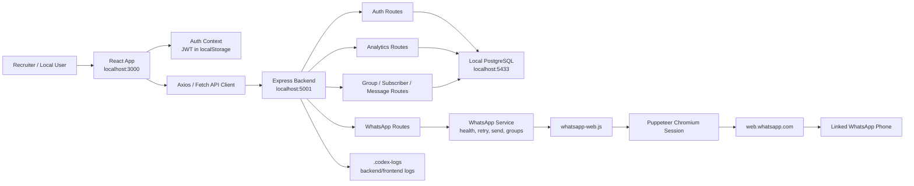

# Watify Portfolio One-Pager

## What Watify Is

Watify is a full-stack WhatsApp operations dashboard built with a React frontend, an Express/Node.js backend, PostgreSQL persistence, and a WhatsApp Web automation layer. The app lets an authenticated user connect a WhatsApp account, inspect available WhatsApp groups, manage local group/subscriber data, and send messages through the connected WhatsApp session.

This portfolio version runs locally for demonstration. The production version was built for Wateen's internal network/IP environment, where the backend APIs and database migrations were handled against their infrastructure.

## How The WhatsApp Connection Works

Watify is not using the official WhatsApp Cloud API. Instead, it uses `whatsapp-web.js`, which launches a controlled Chromium browser through Puppeteer and signs into `web.whatsapp.com` using a QR code. Once the QR is scanned, WhatsApp Web creates a browser session on the backend machine. The backend then talks to that live session to fetch chats/groups, read account info, and send messages.

The automated browser that opens is the WhatsApp Web runtime. It is not meant for the user to manually use. It exists because WhatsApp Web is the interface being automated. If that browser session is closed, blocked, logged out, or unhealthy, the backend can appear connected at first but still fail real operations like listing groups or sending messages.

## Core Features

- Authenticated dashboard with portfolio notice and live backend-driven analytics.
- Local PostgreSQL setup scripts for repeatable development.
- WhatsApp QR login and connection validation.
- Connected phone/account visibility after login.
- Live connection health check before WhatsApp group operations.
- WhatsApp group listing from the connected WhatsApp Web session.
- Message sending flows for individual contacts, local groups, and WhatsApp groups.
- Local migration/model/controller structure for users, subscribers, messages, campaigns, and groups.

## Architecture Diagram

## Request Flow Example

1. The user logs in through the React app.
2. The backend returns a JWT, which the frontend stores locally.
3. The user opens WhatsApp setup and scans the QR code.
4. `whatsapp-web.js` authenticates a Puppeteer-controlled WhatsApp Web session.
5. The backend stores live connection state in memory and exposes `/api/whatsapp/status`.
6. When the user opens List Groups, the backend checks whether the session is operational.
7. If healthy, it calls `client.getChats()`, filters WhatsApp groups, and returns them to the React table.

## Important Portfolio Note

The local portfolio demo proves the full-stack architecture, database layer, authentication, dashboard UI, and WhatsApp Web integration approach. Real deployment needs production-grade handling for secrets, network access, WhatsApp session stability, process supervision, and WhatsApp platform compliance.
